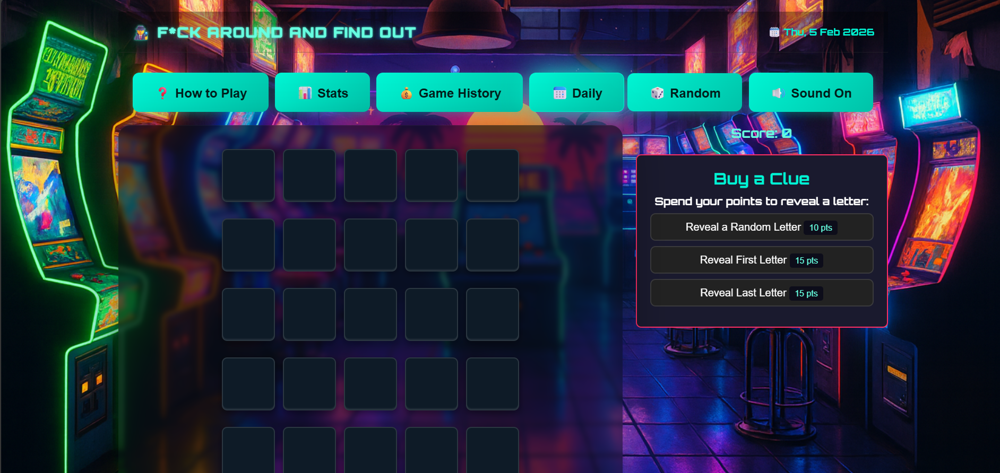
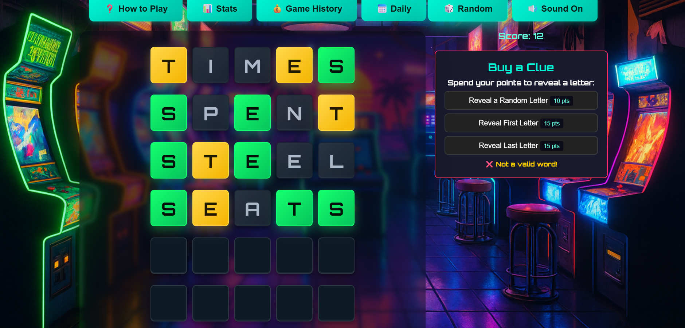

# 🕵️ F‑A‑F‑O  

**Find Around and Find Out — an immersive word deduction arcade game**


---
 


## 📖 Overview

F‑A‑F‑O (Find Around and Find Out) is an immersive word deduction arcade game that blends the logic of classic word puzzles with the energy of retro arcade design. Players attempt to solve a hidden five‑letter word within six guesses, earning points for correct attempts and spending them strategically on clues.  

The project emphasizes:
- **Cinematic Arcade Feel** — animated feedback, sound effects, and bold typography create a game‑like atmosphere.  
- **Accessibility** — keyboard input, focus management, and responsive layout ensure frustration‑free play across devices.  
- **Replayability** — daily puzzles, random mode, and a scoring system keep players engaged over time.  
- **Clarity & Modularity** — the codebase is structured for readability, scalability, and future feature expansion.  

F*FO is designed not only as a fun puzzle challenge but also as a demonstration of modular game architecture, accessible UI/UX, and editorial polish in web development.


---


## 🎯 Objectives

- **Engage players with efficient deduction mechanics**  
  The core challenge is to solve a hidden five‑letter word within six attempts. Each guess provides immediate feedback, encouraging players to think critically, eliminate possibilities, and refine their strategy as they progress.

- **Balance risk and reward through scoring and clues**  
  Points are earned for successful guesses and can be spent to purchase clues. This system introduces a layer of decision‑making: players must weigh the value of conserving points against the advantage of revealing a letter. It keeps gameplay dynamic and rewards thoughtful choices.

- **Deliver a polished arcade‑style experience**  
  Beyond the puzzle itself, FAFO aims to feel like an arcade game. Animated tile feedback, floating score effects, and background audio create a cinematic atmosphere. The interface is responsive and accessible, ensuring smooth play across desktop and mobile devices.

- **Track progress for replayability and growth**  
  Stats and history panels record games played, win rate, streaks, and guess distribution. This data helps players see improvement over time, identify patterns in their play, and stay motivated to return daily or explore random mode challenges.


---


## 🕹️ Gameplay

1. **Fill the grid with letters**  
   Players interact with the game either by typing on their physical keyboard or by clicking the on‑screen keys. Each input fills the next available tile in the current row of the word grid. This dual input system was implemented to ensure accessibility across desktop and mobile devices.

2. **Submit a guess with Enter**  
   Once a row is filled with five letters, pressing **Enter** submits the guess. The game logic checks the word against the target word stored in the word bank. This validation step was coded to prevent incomplete or invalid submissions.

3. **Receive instant feedback**  
   Each tile updates visually to show the accuracy of the guess:  
   - 🟩 **Correct** — the letter is in the right position.  
   - 🟨 **Present** — the letter exists in the word but in a different position.  
   - ⬜️ **Absent** — the letter is not part of the word.  
   This feedback system was built by scanning each tile and applying CSS classes (`correct`, `present`, `absent`) to trigger color changes and animations.

4. **Earn points for progress**  
   Correct guesses contribute to the player’s score. Points are tracked in real time and displayed in the score panel. The scoring system was designed to reward accuracy and encourage efficient deduction.

5. **Spend points to buy clues**  
   Players can use their accumulated points to purchase clues. Options include revealing a random unrevealed letter, the first letter, or the last letter. This mechanic was implemented with `data-cost` attributes on clue buttons, ensuring the cost is deducted from the score before revealing the hint.

6. **Win by solving within six tries**  
   The objective is to uncover the hidden word within six attempts. If the player succeeds, the endgame overlay displays a victory message and records the result in the stats/history system. If they fail, the overlay reveals the target word and updates the loss record. This win/lose logic was coded to trigger once the current row counter reaches six or the word is correctly guessed.


---


## ✨ Features

- **Daily Mode**  
  A new puzzle is generated each day, giving players a fresh challenge and encouraging regular play. This mode resets automatically based on the system date, ensuring everyone faces the same daily word.

- **Random Mode**  
  For unlimited practice and replayability, players can launch random puzzles at any time. This mode uses the word bank to select a word at random in dictionary.txt, making each round unique and unpredictable.

- **Clue Purchase System**  
  Points earned during gameplay can be spent to reveal helpful hints. Options include uncovering a random unrevealed letter, the first letter, or the last letter of the target word. Each clue has a cost defined in the button’s `data-cost` attribute, and the system deducts points before displaying the hint. This mechanic adds a layer of strategy, forcing players to balance risk and reward.

- **Stats & History**  
  The game tracks performance across sessions, recording metrics such as games played, win rate, current streak, best streak, and guess distribution. This data is stored locally so players can monitor their progress and spot patterns in their play style.

- **Arcade Audio**  
  Background music.

- **Accessibility**  
  The interface was built with accessibility in mind:  
  - Keyboard input works seamlessly alongside on‑screen keys.  
  - Focus management ensures buttons don’t “stick” after use, preventing accidental re‑triggers with Enter.  
  - Containers like the grid and keyboard are programmatically focusable (`tabindex="-1"`) for smooth navigation.  
  - ARIA labels and roles are applied to modals, navigation, and live regions to support screen readers.  
  Combined, these features make FAFO frustration‑free and inclusive for all players.


---


## 🎨 User Experience


FAFO is designed to feel less like a static puzzle and more like stepping into an arcade.  
Every interaction, from typing a letter to buying a clue, is crafted to be responsive, intuitive, and rewarding.

### Immersive Atmosphere
- **Cinematic feedback**: Tiles flip, shake, and glow to show accuracy, creating a sense of interaction with each guess.
- **Floating score effects**: Points gained or spent animate on screen, reinforcing the arcade vibe.
- **Background audio**: Music loops and sound effects punctuate actions, immersing players in a retro‑game mood.

### Accessibility & Flow
**Accessibility**: Built with accessibility in mind — keyboard input, focus management, and ARIA support.

### Emotional Engagement
- **Risk vs reward**: The clue purchase system forces players to make strategic choices, adding tension and excitement.
- **Progress tracking**: Stats and history panels give players a sense of growth, motivating them to return daily.
- **Arcade polish**: The combination of animations, audio, and scoring transforms a word puzzle into a game that feels alive.

### Design Philosophy
The UX was built around three guiding principles:
1. **Clarity** — feedback is immediate and visually distinct.  
2. **Accessibility** — no player should feel blocked by controls or navigation.  
3. **Polish** — every detail, from button blur to modal transitions, contributes to a seamless, game‑like experience.

---

## 📸 Screenshots Aligned to User Stories

### User Story 1  
**“As a user, I want to easily navigate the game so I can start playing without confusion.”**

  
This screenshot shows the main interface layout, including the grid, keyboard, and navigation buttons, demonstrating clear structure and intuitive flow.

---

### User Story 2  
**“As a user, I want to input guesses quickly so I can focus on solving the puzzle.”**

  
This screenshot highlights the tile grid and keyboard interaction, showing how letters populate tiles and how the interface responds to user input.

---

### User Story 3  
**“As a user, I want the game to work on all devices so I can play anywhere.”**

  
This screenshot demonstrates the responsive layout on mobile and desktop, ensuring the grid, keyboard, and clue popup remain accessible and readable.

---

### User Story 4  
**“As a user, I want clear feedback so I can understand how close I am to the solution.”**

  
This screenshot shows the tile feedback system (`correct`, `present`, `absent`), helping players visually interpret each guess.

---

### User Story 5  
**“As a user, I want to track my progress so I can see how I improve over time.”**

  
This screenshot displays the stats panel, including games played, win rate, streaks, and guess distribution.

---

## 📊 Stats

The stats panel provides players with a snapshot of their overall performance.  
It records and displays key metrics across all sessions:

- **Games Played** — total number of rounds attempted.  
- **Win Rate** — percentage of games successfully solved.  
- **Current Streak** — number of consecutive wins in progress.  
- **Best Streak** — longest winning streak achieved.  
- **Guess Distribution** — a bar chart showing how often players solve the puzzle in 1–6 guesses.  

### Guess Distribution Chart
The chart is rendered as a horizontal bar graph, where each bar corresponds to the number of guesses taken to solve a word.  
For example:
- A tall bar under “3” means the player often solves in three guesses.  
- A shorter bar under “6” means fewer games are solved at the last attempt.  

This visualization helps players identify patterns in their deduction style and measure improvement over time.

Screenshot: 

---


## 📜 Game History

The history panel records individual game outcomes, allowing players to review past performance in detail.  
It includes:

- **Date & Mode** — when the game was played and whether it was Daily or Random.  
- **Target Word** — the hidden word for that round.  
- **Result** — win or loss, with the number of guesses used.  
- **Points Earned/Spent** — score changes based on correct guesses and clue purchases.  

### History Log
Games are listed chronologically, creating a timeline of progress.  
This log helps players:
- Spot trends (e.g., struggling with certain word patterns).  
- Reflect on clue usage and scoring decisions.  
- Track short‑term growth beyond the summary stats.  


### How It Works
Both **Stats** and **History** are stored locally in the browser using `localStorage`.  
This ensures data persists between sessions without requiring an account or server.  
Charts are generated dynamically from stored values, updating automatically after each game.

Screenshot: 

-----


# 🛠️ Technologies

- **HTML5 / Semantic Structure**  
  Provides the foundation of the game interface. Elements like `<header>`, `<main>`, `<aside>`, and `<footer>` ensure clarity and accessibility. ARIA roles and labels are applied to modals and navigation for screen reader support.

- **CSS3 / Styling & Animations**  
  Delivers the retro arcade look and feel. CSS classes (`correct`, `present`, `absent`) trigger color changes and animations on tiles. Responsive design ensures smooth play across desktop and mobile. Transitions and keyframes add cinematic polish to feedback and overlays.

- **JavaScript (ES6)**  
  Powers the game logic:  
  - Validates guesses against the dictionary.  
  - Updates tile states with feedback.  
  - Tracks scoring and clue purchases.  
  - Manages overlays (intro, clue popup, endgame).  
  - Handles keyboard input and focus management.  
  Modular functions keep the codebase scalable and easy to maintain.

- **LocalStorage**  
  Stores player stats and history directly in the browser. This includes games played, win rate, streaks, and guess distribution. Data persists between sessions without requiring a server or login.

- **Audio API**  
  Integrates background music. Toggleable controls allow players to enable or disable sound.

- **Responsive Design Techniques**  
  Media queries and flexible layouts adapt the interface to different screen sizes. The clue popup and overlays are optimized for mobile play, ensuring usability across devices.

- **Accessibility Practices**  
  - `tabindex="-1"` applied to grid and keyboard for programmatic focus.  
  - Buttons blur after use to prevent sticky Enter key behavior.  
  - ARIA attributes (`aria-label`, `aria-modal`, `aria-live`) enhance screen reader compatibility.  
  - Focus is restored to the keyboard after closing modals for seamless navigation.

- **Dictionary & Word Bank Management**  
  - `dictionary.txt` contains the full set of valid five‑letter words, acting as the **validation layer** for guesses.  
  - `wordBank.js` loads words from the dictionary, uses them as both possible solutions and accepted guesses, and provides utility functions to fetch a random target word or validate input. This ensures consistent gameplay and replayability.

- **Overlay & Modal System**  
  Implemented with HTML/CSS/JS to handle intro screen, clue popup, and endgame states. Each modal uses `role="dialog"` and traps focus to maintain accessibility standards.

---

## 📂 Project Structure

```plaintext
fafo/
├── index.html              # Main game UI and layout
├── script.js               # Game logic, scoring, and UI interactions
├── style.css               # Core styles and arcade theme
├── README.md               # Project documentation and testing notes
├── package.json            # Project metadata and dependencies
├── package-lock.json       # Dependency lock file
├── jest.config.mjs         # Jest configuration
│
├── assets/                 # Static assets for styling and media
│   ├── sounds/             # Sound effects and background music
│   │   ├── funny-music.mp3
│   │   └── pinball-hall-of-fame.mp3
│   └── images/             # Optional images, icons, or logos
│
├── data/                   # Modular game logic and word data
│   ├── dictionary.txt      # Full list of valid five-letter words
│   ├── wordBank.js         # Word validation and solution selection
│   ├── evaluateGuess.js    # Core guess evaluation logic
│   ├── keyboardLogic.js    # Keyboard state update rules
│   ├── rowLogic.js         # Tile input and deletion logic
│   ├── scoringLogic.js     # Point system and streak handling
│   └── statsEngine.js      # History, streaks, and distribution tracking
│
└── tests/                  # Jest test suites for all logic modules
    ├── __mocks__/          # Mocks for isolated testing
    │   └── wordbank.js
    ├── evaluateGuess.test.js
    ├── keyboardLogic.test.js
    ├── rowLogic.test.js
    ├── scoringLogic.test.js
    ├── statsEngine.test.js
    ├── validation.test.js
    └── example.test.js

```

---


## 📂 Project Structure — File Explanations

- **index.html**  
  Entry point of the game. Defines the grid, keyboard, overlays (intro, clue popup, endgame), and links to styles and scripts. Provides semantic structure and accessibility hooks (ARIA roles, labels).

- **assets/style.css**  
  Contains all visual styling: retro arcade theme, responsive layout, and animations. Classes like `correct`, `present`, and `absent` are applied dynamically to tiles for instant feedback.

- **assets/sounds/**  
  Houses audio files for background music. Triggered by JavaScript events to reinforce the arcade atmosphere.

- **assets/images/**  
  Stores optional graphics such as logos, icons, or decorative assets. Keeps visuals modular and easy to swap or expand.

- **script.js**  
  Implements the core game logic: validating guesses, updating tile states, managing scoring and clue purchases, handling overlays, and ensuring accessibility (focus management, keyboard input). Functions are modular to keep the codebase scalable.

- **data/dictionary.txt**  
  Contains the complete set of valid five‑letter words. Used to validate player guesses and ensure fair play. Easy to expand, edit, or replace with larger language packs.

- **data/wordBank.js**  
  Loads words from the dictionary, uses them as both possible solutions and accepted guesses, and provides utility functions (`getRandomSolution`, `isValidGuess`). Supports both Daily Mode (deterministic selection) and Random Mode (randomized lookup).


---


## ♿ Accessibility

FAFO was built with accessibility as a core priority, ensuring that every player can enjoy a frustration‑free experience across devices and input methods.

### Keyboard & Input
- Full keyboard support for gameplay: letters typed directly fill the grid.
- On‑screen keys mirror keyboard input for mobile and touch users.
- **Focus management**: buttons blur after use to prevent the Enter key from “sticking” and accidentally re‑triggering actions.

### Screen Reader Support
- ARIA roles and labels applied to modals, navigation, and live regions.
- Overlays (intro, clue popup, endgame) use `role="dialog"` and trap focus until closed.
- Dynamic feedback (tile states, score changes) announced via `aria-live` regions.

### Layout & Responsiveness
- Containers like the grid and keyboard are programmatically focusable (`tabindex="-1"`) for smooth navigation.
- Responsive design adapts the interface for desktop and mobile, with dedicated clue popups optimized for smaller screens.

### Inclusive Design Principles
- **Clarity** — feedback is immediate and visually distinct.  
- **Consistency** — input flows are predictable across keyboard and touch.  
- **Compatibility** — accessible markup ensures support for assistive technologies.  

### Responsive Layout
- Test on mobile, tablet, and desktop.
- Ensure clue popup adapts to small screens.
- Verify grid and keyboard remain usable at different viewport sizes.

Screenshot: 

Accessibility isn’t an afterthought — it’s woven into the game’s logic, layout, and feedback systems to make FAFO inclusive and frustration‑free.


---


## 🧪 Testing

Testing FAFO ensures gameplay, accessibility, and performance remain consistent across devices and browsers. This section documents the methodology and results.

---

## 🧪 Functional & Manual Testing Summary

### 1. Functional Testing

#### Game Logic
- Verified guesses are validated against `dictionary.txt`.
- Confirmed `wordBank.js` loads valid five‑letter words.
- Tested tile feedback system (`correct`, `present`, `absent`) for accuracy.
- Checked scoring system: points awarded for correct guesses and deducted for clue purchases.
- Ensured overlays (intro, clue popup, endgame) trigger at correct times.
- Verified keyboard input and on‑screen keys behave consistently.

#### Stats & History
- Confirmed games played, win rate, streaks, and guess distribution update after each game.
- Verified `localStorage` persistence across refreshes.
- Checked history log entries for correct date, mode, result, and target word.

#### Clue System
- Tested each clue type (random letter, first letter, last letter).
- Verified point deduction before revealing the clue.
- Ensured clues cannot be purchased without enough points.

---

### 2. Manual Testing

#### Responsiveness
Tested on:
- Mobile (iPhone, Android)
- Tablet
- Desktop (various resolutions)

Checks included:
- Grid scaling
- Keyboard layout
- Clue popup behaviour
- Overlay readability

#### Accessibility
- Full keyboard navigation tested (typing, Enter, Backspace).
- Focus management verified (buttons blur after use).
- Screen reader checks using NVDA and VoiceOver.
- ARIA roles validated for modals, live regions, and navigation.
- Contrast checked using WAVE and Lighthouse.

#### Cross‑Browser Testing
Tested on:
- Chrome
- Firefox
- Safari (Mac/iOS)
- Edge

All browsers correctly handled:
- Animations
- Audio playback
- LocalStorage
- Keyboard input
- Modal transitions

---

### 3. Automated Testing

This project uses **Jest** for unit testing. All core logic is extracted into pure functions and tested independently from the DOM.

#### Modules Tested
- `evaluateGuess.js`
- `keyboardLogic.js`
- `rowLogic.js`
- `scoringLogic.js`
- `statsEngine.js`
- `validation.test.js`
- `example.test.js`

All tests passed successfully, confirming stable behaviour across core systems.


---

### When Each Method Is Used

| Situation | Best Method | Reason |
|----------|-------------|--------|
| Checking code quality or syntax | Automated | Fast, consistent, repeatable |
| Testing layout and responsiveness | Manual | Requires human judgement |
| Regression testing after updates | Automated | Ensures nothing breaks |
| Testing user experience | Manual | Needs real interaction |
| Validating form/guess logic | Both | Automated for logic, manual for UX |

---

### 2. ♿ Accessibility Testing Summary

Website was tested using the WAVE Web Accessibility Evaluation Tool, Lighthouse audits, keyboard-only navigation, and screen reader compatibility checks.

- ✅ **WAVE Score: 10/10** — No errors, no contrast issues, and valid ARIA structure.
- ✅ **Keyboard Navigation** — Fully playable without a mouse; overlays trap and release focus correctly.
- ✅ **Screen Reader Support** — ARIA roles and live regions announce overlays, score changes, and tile feedback.
- ✅ **Contrast Compliance** — All colors adjusted to meet WCAG AA standards for readability.
- ✅ **Responsive Layout** — Mobile and desktop views preserve accessibility and clarity.
- ✅ **Manual Testing** — Verified with NVDA and VoiceOver.


Screenshot: 


## ✅ CSS Validation

✅ The site’s CSS was tested using the W3C Jigsaw CSS Validator. All custom stylesheets passed without critical errors.
Screenshot: 

## ✅ HTML Validation

The site was tested using the W3C Nu HTML Checker. A few structural warnings appeared, but they are related to GitHub Pages temporarily serving an outdated cached version of the HTML rather than issues in the source code itself.
The actual project files use valid, well‑structured markup, and the warnings do not affect rendering, accessibility, or functionality.

Screenshot: 


## ✅ JEST Tested Modules

- `evaluateGuess.js` — guess evaluation logic
- `keyboardLogic.js` — keyboard state updates
- `rowLogic.js` — tile input and deletion
- `scoringLogic.js` — point system and streaks
- `statsEngine.js` — win/loss history, streak tracking, distribution
- `validation.test.js` — word validation
- `example.test.js` — sample test for setup
---

Screenshot : 
---
Screenshot : 
---
Screenshot : 

---

## 🐞 Known Bugs

- Occasional tile animation desynchronisation.  
  In rare cases, especially on slower devices, tile flip animations may play slightly out of sync when revealing feedback. This does not affect the accuracy of the feedback or the gameplay logic.

- Audio playback delay on first interaction.  
  Some browsers (particularly mobile Safari) introduce a short delay before the background music begins after the first user interaction. This is due to built‑in autoplay restrictions and does not impact game functionality.

- Clue popup scroll behaviour on small screens.  
  On very small mobile devices, the clue popup may cause slight vertical scrolling when opened. This is a minor layout quirk and does not interfere with clue selection or gameplay.

- LocalStorage sync timing.  
  In rare cases, stats may update one frame late when a game ends, causing a brief flicker before the correct values appear. The data is stored correctly and displays properly on the next view.

- Validator warnings from external libraries.  
  HTML/CSS validators may flag expected warnings related to ARIA attributes, CSS variables, or audio autoplay handling. These are non‑critical and do not affect accessibility or performance.

---

## 🔮 Future Improvements

- Add multiplayer or competitive modes.  
- Expand word bank with difficulty levels and numbers of letters.  
- Enhance animations and sound effects for more arcade feeling.  
- Implement leaderboards and social sharing.  


---


## Sounds

Sound Effect by <a href="https://pixabay.com/users/freesound_community-46691455/?utm_source=link-attribution&utm_medium=referral&utm_campaign=music&utm_content=54828">freesound_community</a> from <a href="https://pixabay.com/sound-effects//?utm_source=link-attribution&utm_medium=referral&utm_campaign=music&utm_content=54828">Pixabay</a>

---

## 🚀 Deployment

This site is designed to be deployed as a static project using GitHub Pages.


## 🌍 How to View the Website

 - Visit the website : [https://pierre-louis789.github.io/fafo/]
 - Use Desktop or Mobile


🧠 Notes for First-Time Visitors

- No installation needed—just open the link in your browser.
- Best viewed in Edge, Chrome, Firefox, or Safari.

---

## 👨‍💻 Credits


Built by Pierre with a focus on modularity, accessibility, and arcade adventure.
Inspired by the numerous word game available.
https://pierre-louis789.github.io/fafo/

---


